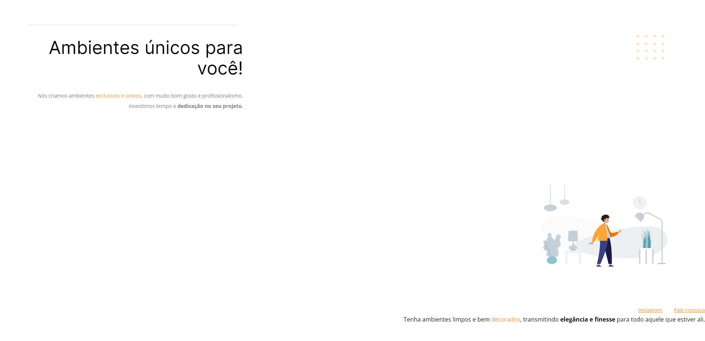
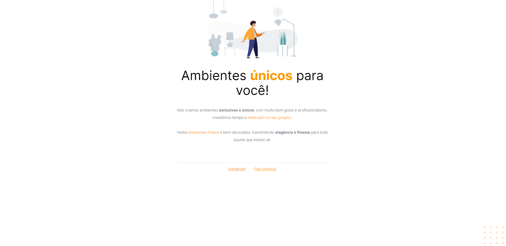

<h1 align="center">Corrigindo Bugs 🧑🏾‍💻</h1>

        
    <a href="https://github.com/Elias-Neto/Explorer/tree/main/nivel02/stage02/desafios/corrigindo_bugs_01/antes"> Veja o código antes</a>

 

         
    <a href="https://github.com/Elias-Neto/Explorer/tree/main/nivel02/stage02/desafios/corrigindo_bugs_01/depois"> Veja o código depois</a>

 

<h2> 💻 Desafio </h2>
Este desafio consiste em pegar uma página cheia de bugs e consertar tanto o HTML como o CSS.

 
 

<h2> 📈 Conhecimento adquirido </h2>

* Reorganizar uma estrutura HTML bagunçada;
* Identificar estilizações desnecessárias no CSS;
* Refatoração de código;
* Interpretação de layouts no Figma;
* Código Limpo.

 
 

<h2> 🛠 Tecnologias usadas </h2>

O projeto foi desenvolvido utilizando as seguintes tecnologias:

- [HTML](https://www.w3schools.com/html/)
- [CSS](https://www.w3schools.com/css/default.asp)
- [Figma](https://www.figma.com/design/)

 
 

 Desenvolvido com 💜 por Leandro Pereira ✌🽠

 

<a href="../../README.md">Voltar</a>
